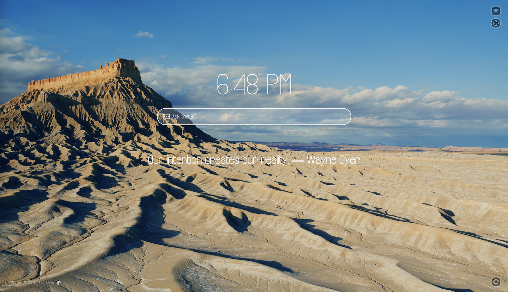

# Chrome-macOS-Screen-Saver-Tab


Transform your Chrome's new tab page by showcasing macOS's aerial screen saver videos.

🖥️ If you're not using macOS, fear not! This extension remains compatible.



## Features

This Chrome extension delivers the following features:

1. 🎥 Enhance your Chrome start page and new tab view with breathtaking 4K videos, taken directly from macOS' native aerial screen savers.
2. 🌦️ Receive up-to-the-minute weather updates accompanied by a 3-day forecast.
3. 💬 Engage with the web version of ChatGPT: simply type into the search box and begin your conversation.
4. 🌟 Discover motivational quotes that change randomly with each new tab.
5. 🔗 Compile your browsing history from the chosen timeframe and offer a quick-access list for your convenience.
6. 😑 Zen mode, you can comfortably space out while accompanied by carefully selected music and watching videos.


## Getting Started

Firstly, Install Macify on Chrome web store,  [Click here](https://chromewebstore.google.com/detail/macify-macos-screensaver/lgdipcalomggcjkohjhkhkbcpgladnoe?hl=zh-CN) to install.

To get started, you need to configure the video source. We offer 3 options:

1. Manually set up a local HTTP server ( recommended ).
2. Directly use the services of Apple Server.
3. Connect to Apple Server using our built-in reverse proxy.

If you're not technically inclined, consider opting for the second or third option.

And, you will need to get your free weatherapi.com API Key, if you want to enable the weather feature.

## Use Apple Server as video source

Using the Apple server as a video source is a good option. However, since the URL where the screensaver videos are located is not trusted by most operating systems, you need to make the system trust the Apple server's certificate first. After that, you will be able to use the Apple server as a video source smoothly.

Simply open this address in Chrome: [https://sylvan.apple.com/](https://sylvan.apple.com/). The first time you open it, you will see a warning. Just click the *Proceed to sylvan.apple.com (unsafe)* button to ignore the warning, and that’s it.


Now, you can enjoy videos from the Apple video source.

## Use built-in reverse proxy as video source

By selecting the Apple Server as the video source and enabling the reverse proxy option, you will use the built-in reverse proxy to fetch videos from Apple indirectly.

This is juet for temporary convenience, it is not recommended to use the built-in reverse proxy for an extended period as it is only a temporary solution.

I cannot guarantee the long-term availability of this built-in reverse proxy.

## Use local HTTP server as video source

It is recommended that you set up a local http server as video source if you are a macOS user.

You will be able to enjoy higher quality, faster-loading 4K videos, it’s very easy to set the server up, just follow the steps that come next.

### Step 1️⃣: Acquire Screen Saver Videos via System Preferences

Ensure you're connected to Internet and proceed to open System Preferences.

Journey to the "Screensaver" settings within System Preferences. Within the aerial screensaver category, select the videos you wish to download. Bear in mind, the file size of each video spans between 500MB to 1GB; patience is required during the download process. Occasionally, downloads might experience interruptions, necessitating multiple attempts.


To conserve storage, it's advised against downloading the entire video collection.

### Step 2️⃣: Initiate a Local Server

1. Download the `videoserver.conf` file from the [code repository](https://github.com/jason5ng32/macOS-Screen-Saver-as-Chrome-New-Tab).
2. Store it in a directory that you intend to keep intact. And make sure the directory can be read by `everyone`, permission of drwxr-xr-x or `755` is great. For demonstration, let's use:

```shell
/path/to/your/videoserver.conf
```

3. Launch the terminal application, and input the following commands.
4. Make a backup of your apache config file utilizing the command below (optional) :

```shell
sudo cp /private/etc/apache2/httpd.conf /private/etc/apache2/httpd.conf.bk
```

5. Next, ensure to replace the path placeholder with your actual path:

```shell
echo -e "\nInclude /path/to/your/videoserver.conf" | sudo tee -a /private/etc/apache2/httpd.conf
```

6. To activate the changes, restart Apache:

```shell
sudo apachectl restart
```

Your local backend service should now be operational, with port 18000 as its designated listening port.

### Step 3️⃣: Make Changes in the Settings

After you set up your local video server, you need to change the server settings in the extension's option page.

In the extension's option, change the video source to "Local Server" and then enter your local address. If you are using the configuration file I provided, the default address is `http://localhost:18000/videos/`.